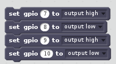
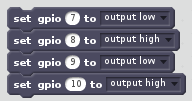
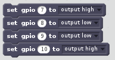
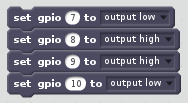
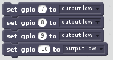

With the motor controller board connected to your Raspberry Pi, and Scratch 2 open, you can control the direction of your motors easily.

- The motor controller board is linked with pins `7`, `8`, `9` and `10`. For the purposes of this guide, the right-hand motor is connected to pins `7` and `8`, and the left-hand motor is connected to pins `9` and `10`. You might not need both motors for your project, however. A single motor can easily be used on its own, connected to either pins `7` and `8`, or pins `9` and `10`.

- To drive both motors forward, you need to set pins `7` and `9` to `high`, and pins `8` and `10` to `low`.

	

- To drive both motors backward, you need to set pins `8` and `10` to `high`, and pins `7` and `9` to `low`.

	

- If you want to turn the motors in opposite directions (for turning a robot, for instance), you could set pins `7` and `10` to `high`, and pins `8` and `9` to `low`.

	

- To turn in the other direction, set pins `8` and `9` to `high`, while setting pins `7` and `10` to `low`.

	
	
- To stop the motors completely, just set all the pins to `low`.

	
